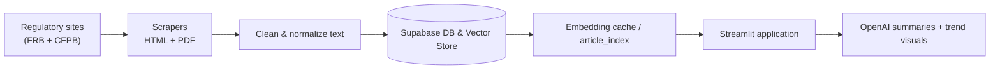

# USAA Fraud Detection
**Semantic monitoring for regulatory press releases**

> Automated ETL, embeddings, and storytelling dashboards that highlight emerging compliance and fraud risks for UNC Charlotte's DTSC 3602 project.

## Authors
- Jack Resnick  
- Andreas Cedron  
- Tommie Clark  
- Ty Warren  

---

## Quick Start
| Step | Command |
| --- | --- |
| Create environment | ```bash
uv venv .venv
source .venv/bin/activate
uv sync
``` |
| Launch dashboard | ```bash
uv run streamlit run streamlit_app3.py
``` |

### Required Environment Variables
| Key | Purpose | Example |
| --- | --- | --- |
| `SUPABASE_URL` | Supabase project REST endpoint | `https://xyzcompany.supabase.co` |
| `SUPABASE_KEY` | Supabase service/anon key | `eyJhbGciOiJIUzI1NiIsInR5cCI6IkpXVCJ9...` |
| `OPENAI_API_KEY` | Embedding + summary API key | `sk-abc123` |

Create a `.env` file (or copy to `example.env`) and populate the values:
```bash
SUPABASE_URL=your_supabase_url
SUPABASE_KEY=your_supabase_anon_key
OPENAI_API_KEY=your_openai_key
```

---

## Project Snapshot
- One-click UV setup, scripted scraper, and Streamlit UI for compliance intelligence.  
- Supabase stores structured press releases from Federal Reserve + CFPB plus OpenAI embeddings for semantic recall.  
- Storytelling view surfaces focus terms, multi-year trends, and GPT-generated insights for analysts.

### Why It Matters
- **Unified fraud intelligence workspace** – Replaces ad-hoc spreadsheets with a governed Streamlit view linking data, embeddings, and AI summaries.
- **Actionable compliance insights** – Focus-word detection pinpoints regulatory concerns so risk teams can prioritize remediation and training.
- **Reusable pipeline** – Parameterized ETL, embeddings, and library components can be adapted to other institutions with minimal change.

### Visual Overview

*Streamlit application (`streamlit_app3.py`) highlighting focus-word filters, yearly trend chart, and article summaries.*

### Folder Structure
```
.
├── data/
│   └── cache/
│       ├── article_embeddings.npz
│       └── article_metadata.pkl
├── images/
│   ├── streamlit_dashboard.png
│   ├── dashboard_demo.gif
│   └── ChatGPT Image Nov 4, 2025, 07_57_35 AM.png
├── notebooks/
│   └── fraud_exploratory.ipynb
├── notes/
│   ├── embeddings_demo.ipynb
│   ├── install_notes.txt
│   └── USAA_Fraud_Detection_Project_Timeline.pdf
├── src/
│   ├── ai/
│   │   ├── article_preprocessing.py
│   │   ├── complaint_preprocessing.py
│   │   ├── fraud_insights.py
│   │   └── query_filter.py
│   ├── article_index.py
│   ├── cfpb_loader.py
│   ├── data_loader.py
│   ├── library_viewer.py
│   ├── openai_summary.py
│   ├── semantic_library.py
│   ├── sidebar_controls.py
│   ├── topic_dashboard.py
│   ├── topic_keyword_utils.py
│   ├── topic_visuals.py
│   ├── universal_scraper_inner.py
│   ├── universal_scraper_outer.py
│   └── usaa_logo.py
├── streamlit_app3.py
├── README.md
└── pyproject.toml
```

---

## Architecture & Data Flow


---

## Data Glimpse & Transform Example
### Sample Record
| id | title | focus_word | date | risk_score |
| --- | --- | --- | --- | --- |
| 1045 | Consent Order on BSA Failures | AML | 2024-03-11 | 0.82 |
| 1096 | Supervisory Letter on Wire Fraud | wire fraud | 2024-05-02 | 0.74 |

### Minimal Transformation Snippet
```python
from src.topic_keyword_utils import infer_focus_phrase

query = "What are the major AML deficiencies regulators highlight?"
keyword = infer_focus_phrase(query, candidate_terms=["AML", "fraud", "BSA"])
print(keyword)  # -> "AML"
```
The Streamlit layer injects this inferred keyword into semantic searches, aligns yearly metrics, and feeds OpenAI summaries.

### Streamlit Data Flow Example
```python
import streamlit as st
from src.data_loader import fetch_articles
from src.topic_visuals import plot_focus_term_trend

st.title("USAA Fraud Detection Dashboard")
articles = fetch_articles()
focus_word = st.text_input("Focus term", "AML")
filtered = articles[articles["focus_word"] == focus_word]
st.pyplot(plot_focus_term_trend(filtered))
```
This minimal example mirrors `streamlit_app3.py`: cached Supabase data drives interactive filters and visuals.

---

## System Overview
1. **Data Collection** – Scrapes Federal Reserve and CFPB (HTML/PDF) releases, standardizes dates, and merges titles/content.  
2. **Data Storage** – Supabase hosts the relational data and embeddings created with `text-embedding-3-small`.  
3. **Semantic Storytelling** – Query-aware similarity search pulls contextually relevant press releases, identifies a focus word, and aggregates yearly metrics.  
4. **AI Summaries** – OpenAI GPT models convert article clusters into contextual narratives for analysts.  
5. **Library Integration** – Semantic collections are saved for rapid recall in review sessions.

---

## Key Features
- Automated regulatory press release scraping.  
- Supabase-backed storage plus vector similarity search.  
- Local cached embedding index for low-latency queries.  
- Domain-specific keyword extraction and focus term detection.  
- Yearly trend visualization tied to the selected focus word.  
- GPT-based summarization for narrative context.  
- Library system to curate compliance topic groups.

---

## Tech Stack
- **Python 3.12** – core language.  
- **Streamlit** – interactive dashboard.  
- **Supabase** – Postgres + vector store.  
- **OpenAI GPT + embeddings** – semantic search, summarization.  
- **Pandas / Matplotlib** – analytics + visuals.  
- **BeautifulSoup4 / Requests / PyPDF2** – scraping + parsing.  
- **uv** – fast environment + execution manager.

---

## Findings & Impact
| Insight | Why it matters | Visual |
| --- | --- | --- |
| Bank Secrecy Act (BSA) findings rose 22% YoY | Highlights priorities for fraud analysts and training | Dashboard focus-word trend chart (see screenshot) |
| Wire fraud remediation deadlines are shorter (<45 days) | Signals urgency for operations teams | Animated GIF demo highlighting alert cards |
| Repeat offenders cluster around 6 institutions | Guides investigative triage and storytelling | Library collections panel in Streamlit |

The project is useful because it compresses multiple compliance workflows (scraping, labeling, trend analysis, and executive storytelling) into a single reproducible Streamlit experience. Analysts can pivot from macro trends to specific consent orders within seconds.

---

## Current Status
- **ETL pipeline, semantic model, and OpenAI summarization are fully operational.**  
- **Focus-term detection and yearly trend visualization functioning correctly.**  
- **Library integration for topic-based article collections implemented.**  
- **Multimodal architecture documented and production-ready.**  

Future improvements: continuous scraping schedule, fine-tuned domain embeddings, and multilingual monitoring.

---

## Acknowledgment
Developed for **DTSC 3602: Data Science Project at UNC Charlotte**, demonstrating machine learning, LLM integration, and visual analytics for regulatory insight automation.  
Drafted with assistance from **ChatGPT** for documentation polish and coding assistance.
