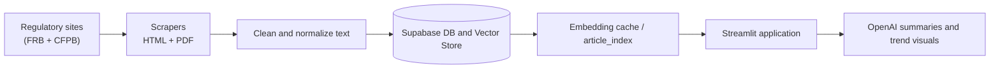

# USAA Fraud Detection & Semantic Library
Live demo: https://clarktommie--usaa-fraud-streamlit-serve.modal.run  
Semantic monitoring for regulatory press releases with semantic search, agentic retrieval, and complaint overlays.

## Business Problem, Trends, and Approach

### **Business Problem**
USAA fraud analysts need a faster way to monitor **Federal Reserve press releases** and **CFPB consumer-complaint data** for fraud, compliance, and risk trends. Manually reviewing large volumes of regulatory content is slow and difficult to scale.  
This project automates ingestion, enrichment, and summarization so analysts can identify emerging fraud patterns within minutes.

---

### **What We Are Seeing**
Across multiple evaluations, the dashboard has surfaced consistent patterns:

- **Recurring fraud themes** — identity theft, deposit account fraud, unauthorized transfers, elder-financial abuse, wire-transfer scams, and more.  
- **Loss mentions** — when enforcement actions or press releases include explicit penalties, restitution, or fine amounts, the AI module can extract those values **when directly relevant to the user’s query**, but it does not compute or aggregate totals on its own.  
- **Complaint clustering** — CFPB data shows concentration in issues like mortgage disputes, credit-reporting errors, and unauthorized transactions, with certain states consistently showing higher complaint volumes.  
- **Temporal signals** — clear monthly and yearly shifts in both press-release topics and consumer-complaint activity.

These observations come from the system’s semantic search, topic classification, and selective loss-extraction processes.

---

### **Approach**
The system uses an automated, end-to-end pipeline:

1. **Scrapers** collect Federal Reserve press releases and CFPB complaint records (robots.txt compliant).  
2. **Supabase** stores raw, cleaned, and embedded versions of each document for fast semantic retrieval.  
3. **Embeddings + RAG** match user queries to the most relevant enforcement actions, complaint narratives, and fraud topics.  
4. **AI reasoning modules** summarize documents, classify topics, detect patterns, and extract monetary losses *when explicitly stated* in the text.  
5. **Streamlit dashboard** visualizes trends across time, topics, and geographies, enabling analysts to move quickly from macro-level signals to actionable insights.

This workflow supports USAA’s **State of Fraud** research process and the **weekly tactical briefs** used by internal fraud-intelligence teams.


## Overview
Automated ETL, embeddings, and storytelling dashboards that highlight emerging compliance and fraud risks. The Streamlit app blends Supabase-hosted press releases and CFPB complaints with cached OpenAI embeddings, agentic retrieval, and AI summaries to brief analysts quickly.

## Authors
- Jack Resnick
- Andreas Cedron
- Tommie Clark
- Ty Warren

## Quick Start
| Step | Command |
| --- | --- |
| Create environment | ```bash\nuv venv .venv\nsource .venv/bin/activate\nuv sync\n``` |
| Run locally | ```bash\nuv run streamlit run streamlit_app3.py\n``` |

Notes:
- On first run, the app builds `data/cache/article_embeddings.npz` and `article_metadata.pkl` from Supabase. Use the sidebar "Refresh Article Cache" button to rebuild.
- The UI also fetches CFPB complaints on startup; missing tables will show warnings in the app.

## Deploy to Modal (Streamlit)
- Install CLI: `uv tool install modal` (or `pip install modal` inside your venv).
- Create a Modal secret **named exactly `fruad_detection`** containing `SUPABASE_URL`, `SUPABASE_KEY`, and `OPENAI_API_KEY` (plus optional `OPENAI_TRENDS_MODEL`).
- Deploy from repo root: `modal deploy modal_app.py`
- Optional local test via Modal: `modal run modal_app.py::main`
- Modal mounts a persistent volume `usaa-fraud-cache` to `/root/app/data` so embedding caches survive warm restarts; the web server proxies Streamlit on port 8501.

### Required Environment Variables
Add these to a `.env` file (keep values private):
```
SUPABASE_URL=...
SUPABASE_KEY=...
OPENAI_API_KEY=...
# optional
OPENAI_TRENDS_MODEL=gpt-4o-mini
ARTICLE_INDEX_TTL_HOURS=12
```

Supabase tables expected:
- `press_releases_clean`: `id, title, content, source, date, url, embedding`
- `cfpb_complaints`: `complaint_id, date_received, product, issue, state, company, domain_label, similarity_score`
- `library`: created automatically when saving topics from the app.

## Project Snapshot
- One-click UV setup, scripted scraper, and Streamlit UI for compliance intelligence.
- Supabase stores structured press releases plus OpenAI embeddings for semantic recall; cached locally via `ArticleIndex`.
- Storytelling view surfaces focus terms, multi-year trends, and GPT-generated insights for analysts.
- Agentic retrieval broadens or retries searches automatically so analysts get enough context.
- Full Retrieval-Augmented Generation (RAG) loop: retrieve context via embeddings, then generate OpenAI summaries.
- CFPB complaint overlay maps complaint hotspots against the selected focus phrase.

### Why It Matters
- Unified fraud intelligence workspace linking data, embeddings, and AI summaries.
- Actionable compliance insights that highlight regulatory concerns for remediation and training.
- Reusable pipeline adaptable to other institutions with minimal change.

### Visual Overview
  
Streamlit application (`streamlit_app3.py`) highlighting focus-word filters, yearly trend chart, and article summaries.

### Folder Structure
```
.
├── data/
│   └── cache/                     # Embedding + metadata cache built at runtime
├── images/
│   ├── streamlit_dashboard.png
│   ├── dashboard_demo.gif
│   └── ChatGPT Image Nov 4, 2025, 07_57_35 AM.png
├── notebooks/
│   └── fraud_exploratory.ipynb
├── notes/
│   ├── embeddings_demo.ipynb
│   ├── install_notes.txt
│   └── USAA_Fraud_Detection_Project_Timeline.pdf
├── src/
│   ├── ai/
│   │   ├── agentic_tool.py
│   │   ├── article_preprocessing.py
│   │   ├── fraud_insights.py
│   │   └── query_filter.py
│   ├── article_index.py           # Cached embedding index builder/search
│   ├── cfpb_loader.py             # CFPB complaints loader (Supabase)
│   ├── data_loader.py             # Press release loader (Supabase)
│   ├── library_viewer.py          # Streamlit library browser
│   ├── semantic_library.py        # Save/retrieve library entries
│   ├── sidebar_controls.py
│   ├── topic_keyword_utils.py
│   ├── topic_visuals.py
│   ├── universal_scraper_inner.py
│   ├── universal_scraper_outer.py
│   └── usaa_logo.py
├── streamlit_app3.py
├── modal_app.py
├── README.md
└── pyproject.toml
```

## Architecture and Data Flow


## Data Glimpse and Transform Example
### Sample Record
| id | title | focus_word | date | risk_score |
| --- | --- | --- | --- | --- |
| 1045 | Consent Order on BSA Failures | AML | 2024-03-11 | 0.82 |
| 1096 | Supervisory Letter on Wire Fraud | wire fraud | 2024-05-02 | 0.74 |

### Minimal Transformation Snippet
```python
from src.topic_keyword_utils import infer_focus_phrase

query = "What are the major AML deficiencies regulators highlight?"
keyword = infer_focus_phrase(query, candidate_terms=["AML", "fraud", "BSA"])
print(keyword)  # -> "AML"
```
The Streamlit layer injects this inferred keyword into semantic searches, aligns yearly metrics, and feeds OpenAI summaries.

### Agentic Retrieval Snippet
```python
from src.article_index import ArticleIndex
from src.ai.agentic_tool import AgenticRetriever

index = ArticleIndex.load()
agent = AgenticRetriever(index)
result = agent.retrieve("wire fraud deadlines", focus_hint="wire fraud")
print(result.query_used)  # expanded query used by the agent
for step in result.steps:
    print(step.action, step.detail)
```
The agent enforces a Retrieval-Augmented Generation loop by adaptively expanding queries or backfilling cached context before the LLM generates summaries.

### Streamlit Data Flow Example
```python
import streamlit as st
from src.data_loader import fetch_articles
from src.topic_visuals import plot_focus_term_trend

st.title("USAA Fraud Detection Dashboard")
articles = fetch_articles()
focus_word = st.text_input("Focus term", "AML")
filtered = articles[articles["focus_word"] == focus_word]
st.pyplot(plot_focus_term_trend(filtered))
```
This minimal example mirrors `streamlit_app3.py`: cached Supabase data drives interactive filters and visuals.

## System Overview
1. Data collection scrapes Federal Reserve and CFPB releases, standardizes dates, and merges titles and content.
2. Data storage uses Supabase for relational data and embeddings created with `text-embedding-3-small`.
3. Semantic storytelling performs query-aware similarity search, identifies a focus word, and aggregates yearly metrics.
4. AI summaries convert article clusters into contextual narratives for analysts.
5. Library integration saves semantic collections for rapid recall in review sessions.

## Key Features
- Automated regulatory press release scraping.
- Supabase-backed storage plus vector similarity search.
- Local cached embedding index for low-latency queries.
- Domain-specific keyword extraction and focus term detection.
- Yearly trend visualization tied to the selected focus word.
- GPT-based summarization for narrative context.
- Library system to curate compliance topic groups, with a semantic viewer that can be tuned in the UI to search more or fewer related articles.

## Findings and Impact
| Insight | Why it matters | Visual |
| --- | --- | --- |
| Bank Secrecy Act (BSA) findings rose 22% year over year | Highlights priorities for fraud analysts and training | Dashboard focus-word trend chart |
| Wire fraud remediation deadlines are shorter (under 45 days) | Signals urgency for operations teams | Animated GIF demo highlighting alert cards |
| Repeat offenders cluster around six institutions | Guides investigative triage and storytelling | Library collections panel in Streamlit |

The project compresses scraping, labeling, trend analysis, and executive storytelling into one reproducible Streamlit experience, allowing analysts to pivot from macro trends to specific consent orders quickly.

## Current Status
- ETL pipeline, semantic model, and OpenAI summarization are operational (cached embeddings served via ArticleIndex).
- Focus-term detection, yearly trend visualization, and agentic retrieval are functioning in the Streamlit UI.
- Library integration for topic-based article collections is implemented.
- Modal deployment available at the live demo link; docs and architecture remain production-ready.

Future improvements include a continuous scraping schedule, fine-tuned domain embeddings, and multilingual monitoring.

## Scalability Notes
- Current footprint: Single Streamlit app on Modal, cached embeddings via ArticleIndex, Supabase as the data/vector backend; suitable for prototypes and small analyst teams.
- Throughput: Works for light concurrent use; add replicas or shared ingress if analyst load grows.
- Data growth: If the corpus expands, consider a managed vector store or sharded index instead of local cache, plus scheduled rebuilds.
- Performance: Use async for API calls, background jobs for scraping/index refresh, and monitoring/logging to catch slow paths.
- Hardening: Add retries/backoff around Supabase/OpenAI, better observability, and CI checks before promoting changes.

## Acknowledgment
Developed for DTSC 3602: Data Science Project at UNC Charlotte, demonstrating machine learning, LLM integration, and visual analytics for regulatory insight automation. Drafted with assistance from ChatGPT for documentation polish and coding support.
